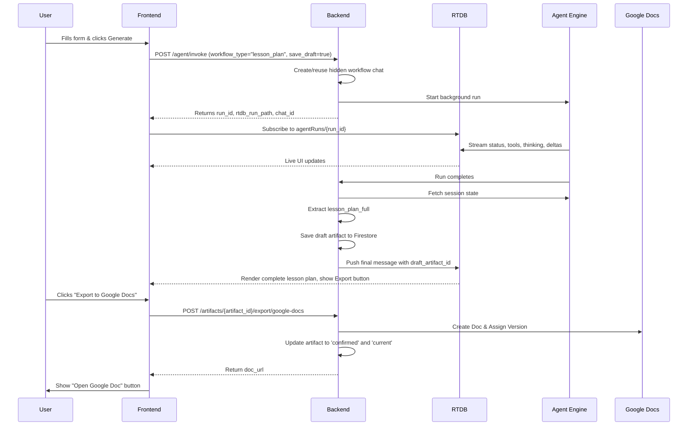

# Standalone Lesson Plan Integration

## 1. High-level workflow

The standalone Lesson Plan generation page operates independently of the standard chat interface. It leverages a structured form to collect user inputs, triggers a specialized agent workflow in the background, streams real-time updates via RTDB, and handles artifacts specifically as drafts until explicitly exported.

The high-level workflow is as follows:

1. User opens the Lesson Plan page.
2. User selects a batch and fills out the required form fields.
3. Frontend calls `POST /agent/invoke` with `workflow_type="lesson_plan"`, `week`, and `save_draft=true`.
4. Backend creates or reuses a hidden workflow chat to isolate the generation state.
5. Backend starts an Agent Engine run in the background.
6. Frontend subscribes to Firebase RTDB using the returned `run_id` to listen for stream events.
7. Agent streams status, tool usage, thinking steps, and response deltas.
8. Backend collects the final response once the agent completes the run.
9. Backend fetches the Agent Platform session state.
10. Backend extracts `lesson_plan_full` from the state.
11. Backend saves the extracted lesson plan as a draft artifact in Firestore.
12. Frontend loads the draft artifact or uses the final message metadata.
13. User clicks "Export to Google Docs".
14. Frontend calls the backend artifact export endpoint directly.
15. Backend creates a Google Doc directly via Google Workspace APIs and updates the artifact from `draft` to `confirmed`/current.



## 2. Required form fields

The standalone page must collect specific fields to structure the prompt accurately for the Agent Engine.

**Required fields:**
- `batch_id`
- `week`
- `topic`
- `grade` / academic level
- `lecture_duration`
- `difficulty`
- `teaching_approach`
- `prior_knowledge`
- `lesson_plan_type`

**Optional / type-specific fields:**
- `lab_environment`
- `programming_language`
- `scenario_context`
- `project_deliverable`
- `pre_class_materials`

**Key Distinctions:**
- **Teaching approach** refers to the pedagogy employed (e.g., direct, inquiry-based, project-based, mixed).
- **Lesson plan type** refers to the structural template or format (e.g., standard, lab_based, scenario_based, project_based).
- These are distinct concepts and should be handled separately in the form.

## 3. Backend endpoint: start standalone generation

To start the standalone generation, the frontend calls the agent gateway endpoint.

**Endpoint:**
`POST /agent/invoke`

**Auth:**
- Firebase bearer token is required.

**Request body example:**
```json
{
  "batch_id": "BATCH_ID",
  "workflow_type": "lesson_plan",
  "week": 3,
  "save_draft": true,
  "connectors": {
    "web_search": true,
    "google_workspace": false
  },
  "message": "Generate lesson plan only. Do not export to Google Docs. Inputs: ..."
}
```

**Key rules:**
- `chat_id` is optional when `workflow_type` is provided.
- For standalone generation, do **not** pass `chat_id` unless explicitly reusing an existing workflow chat. The backend will automatically create or reuse a hidden workflow chat based on the `batch_id`, `workflow_type`, and `week`.
- `google_workspace` must be `false` for generation to prevent the agent from attempting its own export.
- Google OAuth is not required at the generation stage.
- `save_draft` must be `true` to ensure the backend creates a draft artifact upon completion.

**Response shape:**
```json
{
  "run_id": "run_xxx",
  "chat_id": "workflow_chat_id",
  "rtdb_run_path": "agentRuns/run_xxx",
  "status": "running"
}
```
*Note: The response correctly returns `chat_id` which should be stored by the frontend for potential reload scenarios.*

## 4. Prompt/message format sent to /agent/invoke

The frontend should construct a deterministic and structured prompt using a builder. The prompt contains all the form inputs.

**Example format:**
```text
Generate lesson plan only. Do not export to Google Docs.
Save the generated lesson plan as a draft artifact after generation.

Inputs:
- Topic: Introduction to Low-Code Development
- Week: 1
- Academic level: Undergraduate Year 2
- Duration: 90 minutes
- Difficulty: Beginner
- Teaching approach: inquiry-based
- Prior knowledge: basic spreadsheet/database concepts
- Lesson plan type: standard
- Optional context: ...
```

**Guidelines:**
- Keep the prompt structured and clear.
- Do not ask the frontend to send trusted batch metadata (like `lecturer_id` or `datastore_id`); the backend injects trusted state securely.
- Only user-provided lesson inputs should go in the message.

## 5. Hidden workflow chat behavior

The backend encapsulates the state of the lesson plan generation inside a hidden workflow chat.

**Firestore shape:**
`batches/{batch_id}/chats/{chat_id}`
```json
{
  "type": "workflow",
  "workflow_type": "lesson_plan",
  "week": 3,
  "hidden": true,
  "title": "Lesson Plan Week 3 Workflow",
  "agent_session_id": "pnai-chat-...",
  ...
}
```

**Behavior:**
- Hidden workflow chats should **not** appear in the normal chat sidebar.
- They isolate the lesson-plan state from free-form chat.
- One workflow chat may be reused per `batch` + `workflow_type` + `week`.
- Every agent run still lives under: `batches/{batch_id}/chats/{workflow_chat_id}/runs/{run_id}`.

## 6. RTDB streaming contract

The frontend must subscribe to Firebase RTDB to render real-time generation progress.

**Document root path:**
`agentRuns/{run_id}`

**Document children:**

- `agentRuns/{run_id}/status`
  - Values: `"running"` | `"done"` | `"failed"`

- `agentRuns/{run_id}/events/{event_id}`
  - Kinds: `process`, `tool`, `thinking`, `retrieval`, `artifact`, `error`, `message`
  - Example tool event:
    ```json
    {
      "event_id": "abc",
      "run_id": "run_xxx",
      "kind": "tool",
      "status": "running",
      "title": "Tool: lesson_plan_research_worker",
      "summary": "Starting lesson_plan_research_worker",
      "detail": {},
      "created_at": 1780000000
    }
    ```
  - Example thinking event:
    ```json
    {
      "kind": "thinking",
      "status": "running",
      "title": "Thinking",
      "summary": "Checking course materials.",
      "detail": {
        "mode": "public_delta",
        "text": "Checking uploaded course materials and optional web context."
      }
    }
    ```
    *Note: "Thinking" represents public working notes only. Do not label or expose it as hidden chain-of-thought.*

- `agentRuns/{run_id}/steps/{step_id}`
  - Example:
    ```json
    {
      "step_id": "lesson_plan.research",
      "title": "Searching course materials",
      "status": "running",
      "detail": {},
      "updated_at": 1780000000
    }
    ```

- `agentRuns/{run_id}/stream_deltas/{index}`
  - Example:
    ```json
    {
      "index": 0,
      "delta": "## Lesson Plan...",
      "created_at": 1780000000
    }
    ```

- `agentRuns/{run_id}/stream_meta`
  - Example:
    ```json
    {
      "done": false,
      "chunk_count": 4,
      "final_length": 1200,
      "updated_at": 1780000000
    }
    ```

- `agentRuns/{run_id}/messages/{message_id}`
  - Final message example:
    ```json
    {
      "role": "assistant",
      "content": "...final markdown...",
      "metadata": {
        "draft_artifact_id": "artifact_xxx",
        "artifact_type": "lesson_plan",
        "week": 3,
        "exportable": true
      }
    }
    ```

## 7. Frontend streaming behavior

The frontend UI should respond to the RTDB streams as follows:
- Subscribe to `agentRuns/{run_id}`.
- Render status, tool execution, and progress in a collapsible "Completed/Running" section.
- Render thinking events in a collapsible "Thinking" section.
- Render the response incrementally from `stream_deltas` while the status is running.
- Replace the streamed response with the final `content` when the final message arrives in `messages/{message_id}`.
- Auto-scroll the view when tools, thinking events, or deltas arrive.
- Collapse the status and thinking sections when the response begins streaming.
- Keep the status and thinking sections collapsed after the run is complete.
- On page reload, use the persisted message metadata and RTDB replay (or fetch from the run endpoint) to restore details.

## 8. Draft artifact creation

When the agent run completes, the backend automatically performs post-run operations to persist the generated data as a draft.

**Backend behavior:**
- Fetches the Agent Platform session state.
- Extracts `lesson_plan_full` from the state payload.
- Saves the extracted content as a draft artifact in Firestore.

**Firestore shape:**
`batches/{batch_id}/artifacts/{artifact_id}`
```json
{
  "artifact_type": "lesson_plan",
  "type": "lesson_plan",
  "status": "draft",
  "is_current": false,
  "version": null,
  "title": "...",
  "week": 3,
  "content_json": {...LessonPlanFull...},
  "rendered_markdown": "...",
  "source_run_id": "run_xxx",
  "source_chat_id": "workflow_chat_id",
  "created_by": "lecturer_uid",
  "created_by_email": "...",
  "created_at": "...",
  "updated_at": "..."
}
```

**Key behaviors:**
- Drafts do **not** consume version numbers.
- Drafts are **not** marked as current artifacts.
- The Export action assigns the official version and promotes the draft to current.

## 9. How frontend finds draft artifact

To locate the draft artifact, the frontend should follow this priority order:

1. Use the final RTDB message `metadata.draft_artifact_id`.
2. Use the Firestore chat final message `metadata.draft_artifact_id` after a page reload.
3. Use the run endpoint if it returns `draft_artifact_id`.
4. Fallback: Query the artifacts list filtered by type, week, and status, then match the `source_run_id`.

**Relevant endpoints:**
- `GET /batches/{batch_id}/chats/{chat_id}/runs/{run_id}`
- `GET /batches/{batch_id}/artifacts?type=lesson_plan&week=3&status=draft`
- `GET /batches/{batch_id}/artifacts/{artifact_id}`

## 10. Export to Google Docs

Exporting the draft to Google Docs is a direct frontend-to-backend operation.

**Endpoint:**
`POST /batches/{batch_id}/artifacts/{artifact_id}/export/google-docs`

**Auth:**
- Firebase bearer token required.
- User must own the batch.
- User must have valid Google OAuth with required scopes.

**Request body:**
- None (or empty JSON if required by the networking client).

**Success response example:**
```json
{
  "artifact_id": "artifact_xxx",
  "status": "confirmed",
  "version": 1,
  "doc_url": "https://docs.google.com/document/d/...",
  "doc_id": "...",
  "drive_file_name": "v01 - Week 03 - Lesson Plan - ..."
}
```

**Behavior:**
- Backend validates that the artifact is of type `lesson_plan` and its status is `draft` (or `failed_export`).
- Backend validates Google OAuth credentials.
- Backend creates the Google Doc directly using Google Workspace APIs.
- Backend assigns the next sequential version.
- Backend updates the same artifact to `confirmed` and sets it as `is_current: true`.
- Backend supersedes any previously current lesson plan for the same week.
- Backend returns the `doc_url` and related metadata.

**Error examples:**
`403 Forbidden` (Google OAuth Required):
```json
{
  "detail": {
    "code": "GOOGLE_OAUTH_REQUIRED",
    "message": "Connect Google Workspace before exporting to Google Docs.",
    "connect_url": "/auth/google-scopes"
  }
}
```

**Crucial constraints:**
- The Export button must **not** call `/agent/invoke`.
- The Export button must **not** call the Agent Engine.
- Export works reliably in local environments (local backend + deployed Agent Engine) because the entire export flow operates directly from the frontend to the backend to Google APIs.

## 11. Google OAuth check

Before allowing the user to export, the frontend should verify their Google OAuth status.

**Endpoint:**
`GET /auth/google/status`

**Expected frontend behavior:**
- Before exporting, call the Google status endpoint.
- If `valid` is true and `has_google_scopes` is true, enable the Export button.
- If invalid or missing scopes, show a "Connect Google" button.
- The Connect button should trigger the existing OAuth flow (e.g., `authService.startGoogleOAuth()` / redirecting to `connect_url`).

**Required scopes for Docs export:**
- `documents`
- `drive.file`

## 12. Response parsing / Sources chip

The Agent Engine's final markdown response may append a section detailing the tools and sources used.

**Behavior:**
- The Agent final response may include a "Sources & Tool Status" Markdown section.
- Look for the exact heading: `## Sources & Tool Status`
- The frontend should split this section out of the main response body.
- Render it as a collapsed "Sources" chip or panel below the main content.
- This ensures the main lesson plan content remains clean and focused.

## 13. Reload behavior

If the user reloads the page during or after generation, the standalone page should seamlessly recover the state.

**On page reload:**
1. Restore the `batch`, `week`, and form state from the route or local state management.
2. Load the latest relevant draft or confirmed artifact.
3. If a `run_id` is present in the URL or stored state, resubscribe to the RTDB run path.
4. Show the generated lesson plan from `artifact.rendered_markdown` or the final message content.
5. If the artifact status is `draft` or `failed_export`, show the Export button.
6. If the artifact is `confirmed` and `doc_url` exists, show an "Open Google Doc" button instead.

**Recommended route shape:**
- `/lesson-plans?batch=<batch_id>&week=<week>`
or
- `/batches/:batchId/lesson-plans/week/:week`

## 14. Local vs deployed mode

The standalone page supports hybrid local development out-of-the-box.

**Local hybrid (frontend localhost → backend localhost → deployed Agent Engine):**
- Generation works normally.
- Draft saving works because the backend directly queries the Agent Platform session state after the run finishes.
- Export works because the frontend calls the local backend, which communicates directly with Google APIs.
- Agent-side Google tools are **not** required for this flow.

**Deployed (frontend deployed → backend deployed → deployed Agent Engine):**
- The same flow works identically.
- Agent-side Google tools may additionally function if `PNAI_BACKEND_INTERNAL_URL` is configured, but the standalone lesson plan workflow does not depend on them.

## 15. Implementation checklist for standalone developer

- [ ] Build form with all required fields.
- [ ] Validate form inputs before triggering `POST /agent/invoke`.
- [ ] Call `/agent/invoke` with `workflow_type="lesson_plan"` and `save_draft=true`.
- [ ] Subscribe to the RTDB run path using the returned `run_id`.
- [ ] Render run details, thinking events, and response deltas in real-time.
- [ ] Load and persist the `draft_artifact_id` from the final message.
- [ ] Render the generated lesson plan content cleanly (separating the Sources section).
- [ ] Add an "Export to Google Docs" button.
- [ ] Check Google OAuth status before permitting export.
- [ ] Call the artifact export endpoint directly when exporting.
- [ ] Handle `GOOGLE_OAUTH_REQUIRED` errors gracefully.
- [ ] Show an "Open Google Doc" button after a successful export.
- [ ] Implement state restoration to handle page reloads gracefully.

## 16. Testing checklist

Perform the following manual tests to verify the integration:

1. **Generate without Google connected:**
   - Generation should complete successfully.
   - The draft artifact should be saved.
   - The export action should prompt for a Google connection.

2. **Generate with Google connected:**
   - Generation should complete successfully.
   - The export action creates the Google Doc.
   - The artifact transitions from `draft` to `confirmed`/`current`.

3. **Reload after draft:**
   - The generated draft should remain visible.
   - The Export button should still be shown.

4. **Reload after export:**
   - The "Open Google Doc" button should be visible.
   - The Export button should no longer be shown.

5. **Generate same week twice:**
   - Multiple drafts are allowed to exist.
   - Only exported artifacts receive version numbers.
   - The next export should correctly receive the subsequent version number.

6. **Hidden workflow chat:**
   - Verify that the workflow chat does not appear in the standard user-facing chat sidebar.

7. **RTDB streaming:**
   - Status, thinking, and tools should stream properly while the agent is running.
   - The final response should stream through deltas smoothly.
   - The final message and its metadata should persist correctly after completion.
